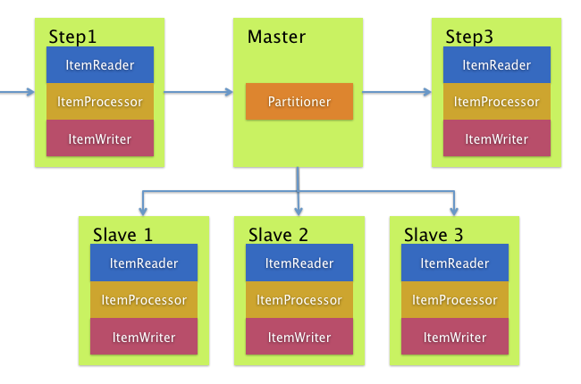

# E-Vision-Technical-Task

##  Description of Task
- We have FileA & Directory that contains a pool of files (File1, File2, File3, ... , FileN).
- We need to calculate similarity score between FileA and each file in the Directory.
- Similarity score is calculated based on the number of common words between FileA and each file in the Directory.
- Maximum Number of words in each file about 10M words
- Maximum Number of files in Directory about 20 files
---
## Solutions
- We designed 3 different approaches to solve the problem.
- Notice in All Approaches we will use HashMap<String,Integer> to calculate similarity score. (Best Way to handle repeat of words)
---
### First Approach is using HashMap and compare

#### Steps
1. Read FileA and store each word in HashMap with its frequency.
2. For each file in the Directory, read the file and store each word in another Hash
3. Map with its frequency.
4. Compare the two HashMaps and calculate the similarity score based on the number of common words
5. Store the result in a List
6. Sort the List based on similarity score in descending order
7. Return the sorted List

####  Time Complexity : O(N + Y*M)
- N is Number of words in FileA and 
- M is the number of words in each file in the Directory.
- Y is the number of files in the Directory.
#### Space Complexity : O(K + L)
- K is the number of unique words in FileA
- L is the number of unique words in each file in the Directory.
#### Advantages
- Memory efficient, As we process one file at a time.
- Minimal space usage, as we only store two HashMaps at a time.
- Use Stream Reading to read files, which is memory efficient.
- Best case : when number of unique words in files is low.
- Worst case : when number of unique words in files is high.
#### Disadvantages
- Slower than other approaches, as we need to read each file in the Directory one by one.
---
### Second Approach is using HashMap and Multi-threading
#### Steps
1. Read FileA and store each word in HashMap with its frequency.
2. For each file in the Directory, create a new thread to read the file and store
3. each word in another HashMap with its frequency.
4. Compare the two HashMaps and calculate the similarity score based on the number of common words
5. Store the result in a List
6. Sort the List based on similarity score in descending order
7. Return the sorted List
#### Time Complexity : O(N + M)
- N is Number of words in FileA
- M is the number of words in each file in the Directory.
#### Space Complexity : O(K + L*Y)
- K is the number of unique words in FileA
- L is the number of unique words in each file in the Directory.
- Y is the number of files in the Directory.
#### Advantages
- Faster than the first approach, as we can read multiple files in the Directory simultaneously.
- Use Stream Reading to read files, which is memory efficient.
- Best case : when number of unique words in files is low.
- Worst case : when number of unique words in files is high.
#### Disadvantages
- More memory usage, as we store multiple HashMaps at a time.
---
### Third Approach is using Spring Batch

#### Why Spring Batch
- Spring Batch Approach For this task is the most General and flexible approach, like if want to make similarity score between objects, not words.
- Spring Batch is a framework for batch processing, which is designed to handle large volumes of data.
- It provides a robust and scalable way to process data in chunks, making it ideal for tasks like this.
- It also provides features like transaction management, job scheduling, which is not used in this task but can be useful in real world applications.

#### How to apply Spring Batch to solve this problem

- In our problem we have Mainly 1 Job
- The Job is to calculate the similarity score between fileA and all files in the pool
- The Job Have Mainly 2 Steps
  1. First Step : To calculate the frequency of all words in fileA
  2. Second Step : this step goal is iterate throw all files in the pool, and calculate similarity score

#### Second Step Detailed 
- In order to make second step fast, we use a good approach by having a parallel processing with each file
- We Have (Master Step) this step will partition all files in the directory, and map each one for a (Slave Step), which will be on it's own thread
- 
- For Each (Slave Step we calculate a the score and store to sort it in the end)

#### Advantages
- Spring Batch is explicitly designed for processing large volumes of data, which aligns perfectly with the constraint of files containing up to 10 million words. Its chunk-oriented processing model is ideal for this.
- It handles resource management (I/O, memory) efficiently, preventing OutOfMemoryError by processing data in configurable chunks
- If the application crashes during the processing of the 15th file in a 20-file pool, Spring Batch can be configured to restart the job from the point of failure, avoiding the need to recalculate the first 14 files.
- Fast by using Parallel Processing

#### Disadvantages
- Complex